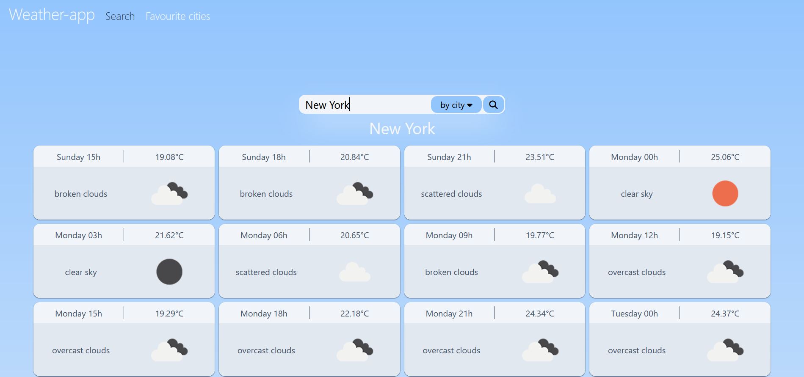

### Lua Packages
 - lua version: lua 5.1
 - https://luarocks.org/modules/manoelcampos/xml2lua
 - https://luarocks.org/modules/openresty/lua-cjson
 - https://luarocks.org/modules/dougcurrie/lsqlite3
 - https://luarocks.org/modules/daurnimator/http

 - server
   - https://luarocks.org/modules/hisham/coxpcall

### Vue Packages
 - vue version: vue 3
 - https://www.npmjs.com/package/@vueuse/core

### Console
 
To run console-app: Run console.lua file and make sure you have required packages.
  
  
  

### Server
  
To run server: Run server.lua file and make sure you have required packages.

  
Access frontend by one of the the ways: 

  
1.  run npm run dev ( to use development server )
   
2.  run npm run build and go to localhost:3000/dist/index.html ( to serve builded files )
  

### Showcase
 #### Console
 
 #### Server
 
